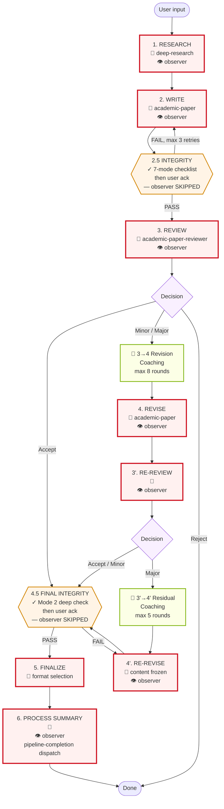
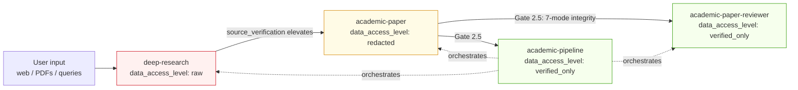
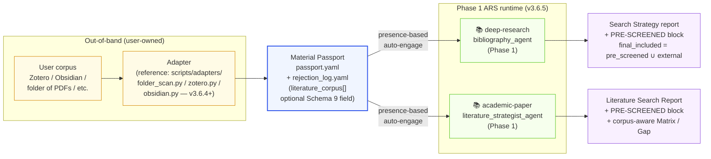
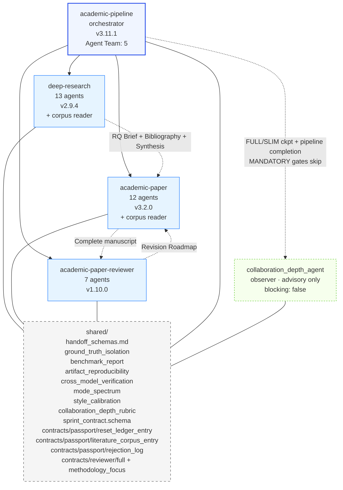

# ARS Pipeline Architecture (v3.11.1)

Full pipeline view across stages × skills × artifacts × gates. Every completed stage requires a user-confirmation checkpoint (per `academic-pipeline/SKILL.md` and `pipeline_state_machine.md`); the diagrams below surface the **decision-heavy** checkpoints visually so they are easy to locate. The post-stage confirmation checkpoints at 2.5 and 4.5 are machine-verified first, then confirmed by the user — they are not skipped.

## How to read

- **Flow diagram** (§2): macro view — which stage follows which, where loops exist, where gates block. Every rectangle ends in a post-stage user confirmation (elided for readability); 🧑 markers call out the decision-heavy moments where the user chooses a branch.
- **Matrix** (§3): the only place where (stage × skill × mode × data_level × artifacts × agents × gate) all co-exist. Use this when asking "what happens at Stage X?" The Gate column lists both machine checks and the user-confirmation checkpoint that closes the stage.
- **Data access flow** (§4) and **skill graph** (§6): orthogonal views answering "who sees what" and "who depends on what" respectively.
- **Literature corpus flow** (§5): producer/consumer view of the optional Material Passport `literature_corpus[]` input port (v3.6.4) and Phase 1 consumer integration (v3.6.5).
- **Quality gates** (§7): zoom on the blocking checks — both machine-enforced and human-enforced.
- **Timeline** (§8): why the architecture looks the way it does — each release added one honesty primitive or a new contract.
- **Modes** (§9): reference when composing a pipeline invocation.

The matrix alone is insufficient: it hides data-access hierarchy and skill dependency. The diagrams alone are insufficient: they hide artifact flow and per-stage agent detail. Together they are the full architecture.

## 1. Checkpoints (at-a-glance)

The pipeline has **two classes of user checkpoint**. Both require the user to confirm before the pipeline advances; they differ in what the user is actually deciding.

**Decision-heavy checkpoints** — the user chooses a branch or accepts a material decision:

| # | Stage | What the user decides |
|---|---|---|
| 🧑 1 | 1. RESEARCH | RQ Brief + Methodology Blueprint |
| 🧑 2 | 2. WRITE | Outline approval before drafting |
| 🧑 3 | 3. REVIEW | Editorial decision (Accept / Minor / Major / Reject) |
| 🧑 4 | 3 → 4 Revision Coaching | Revision strategy (up to 8 Socratic rounds; user can skip) |
| 🧑 5 | 4. REVISE | Revision changes confirmed |
| 🧑 6 | 3'. RE-REVIEW | Verification-review decision |
| 🧑 7 | 3' → 4' Residual Coaching | Residual-issue trade-offs (up to 5 Socratic rounds; user can skip) |
| 🧑 8 | 4'. RE-REVISE | Content frozen — no further review loop |
| 🧑 9 | 5. FINALIZE | Output format selection (MD / DOCX / LaTeX / PDF) |
| 🧑 10 | 6. PROCESS SUMMARY | Language confirmation + collaboration quality review |

**Post-stage confirmation checkpoints** — machine verification runs first; the user then acknowledges the integrity report before proceeding. These are also user-gated (per `pipeline_state_machine.md` — every stage ends in `[checkpoint]`), but the decision is "acknowledge the automated report" rather than "choose a branch":

| # | Stage | What runs | What the user acknowledges |
|---|---|---|---|
| ✓ 1 | 2.5 INTEGRITY | 7-mode failure checklist (see §3 for exact taxonomy) | Integrity Report PASS/FAIL + any SUSPECTED flags |
| ✓ 2 | 4.5 FINAL INTEGRITY | Deep Mode 2 check, zero-tolerance | Final Integrity Report PASS + populated Material Passport |

## 2. Pipeline Flow

**Legend:**
- **Solid red (🧑)** = decision-heavy human gate — the user chooses a branch or approves a material decision.
- **Solid orange (✓)** = integrity gate — machine verification runs first, user then acknowledges the report. Not skipped.
- **Green** = Socratic coaching sub-stage. User may engage or say "just fix it" to skip the dialogue.
- **👁 observer** (v3.5.0) = `collaboration_depth_agent` dispatches at every FULL/SLIM checkpoint + pipeline completion. **Never blocks.** Advisory only. MANDATORY integrity gates (2.5 / 4.5) explicitly skip the observer so compliance checks are not diluted.

## 3. Stage × Dimension Matrix

| Stage | Skill / Mode | Data level | Artifact produced | Core agents | Gate / Checkpoint |
|---|---|---|---|---|---|
| **1. RESEARCH** | `deep-research` v2.9.4 (full / socratic / lit-review / systematic-review / fact-check / review / quick) | RAW | RQ Brief; Methodology Blueprint; Annotated Bibliography (S2-verified); Synthesis Report; INSIGHT Collection. **Search Strategy report includes PRE-SCREENED block (v3.6.5)** when Material Passport carries `literature_corpus[]` | research_question_agent; research_architect_agent; **📚 bibliography_agent (v3.6.5+ corpus reader — corpus-first / search-fills-gap flow)**; source_verification_agent; synthesis_agent; meta_analysis_agent; editor_in_chief_agent; devils_advocate_agent; risk_of_bias_agent; ethics_review_agent; **🟦 socratic_mentor_agent (v3.5.1 reading-check probe layer, opt-in)**; report_compiler_agent; monitoring_agent (13 agents); **👁 collaboration_depth_agent (v3.5.0, advisory)** | 🧑 **Decision-heavy checkpoint:** user confirms RQ brief + methodology. Machine checks: S2 API Tier-0 verification (Levenshtein ≥ 0.70); evidence hierarchy graded; anti-sycophancy on DA (score 1-5, concede only ≥ 4); **corpus-first flow with 4 Iron Rules + F3/F4 provenance reporting (v3.6.5)** when corpus present. 👁 Observer runs post-checkpoint; never blocks |
| **2. WRITE** | `academic-paper` v3.2.0 (full / plan / outline-only / lit-review / revision-coach / abstract-only / citation-check / disclosure / format-convert / revision) | REDACTED | Paper Configuration Record; Outline; Argument Map; Draft Text; Bilingual Abstract; Figures + Captions; Citation List. **Literature Search Report includes PRE-SCREENED block (v3.6.5)** when Material Passport carries `literature_corpus[]`; merged `final_included` set feeds the Literature Matrix and Research Gap Identification | 12-agent pipeline: intake_agent; **📚 literature_strategist_agent (v3.6.5+ corpus reader — corpus-first / search-fills-gap flow)**; structure_architect_agent; argument_builder_agent; draft_writer_agent; citation_compliance_agent; abstract_bilingual_agent; peer_reviewer_agent; formatter_agent; socratic_mentor_agent; visualization_agent; revision_coach_agent; **👁 collaboration_depth_agent (v3.5.0, advisory)** | 🧑 **Decision-heavy checkpoint:** outline approved before drafting. Machine checks: anti-leakage protocol (unsupported fill → `[MATERIAL GAP]`); VLM figure verification (10-pt APA checklist, max 2 refinements); style calibration vs user voice; Stage 2 parallelization (Phase 1 + visualization after outline); **corpus-first flow with 4 Iron Rules + F3/F4 provenance reporting (v3.6.5)** when corpus present. 👁 Observer runs post-checkpoint; never blocks |
| **2.5 INTEGRITY** | `academic-pipeline` v3.11.1 (gate) | VERIFIED_ONLY | Material Passport (Schema 9, required) + `repro_lock` (v3.3.5, declared — populated or `null`); Claim Verification Report (pre-review sampling: 30% of claims, min 10 — per `claim_verification_protocol.md`); Data Provenance Audit | integrity_verification_agent; state_tracker_agent; pipeline_orchestrator_agent. **👁 collaboration_depth_agent: SKIPPED (MANDATORY gate — observer dilution explicitly prevented)** | ✓ **Integrity gate** + user ack. 7-mode AI failure checklist (Lu 2026, canonical order per `ai_research_failure_modes.md`): **M1** implementation bug passing AI self-review; **M2** hallucinated citation; **M3** hallucinated experimental result; **M4** shortcut reliance; **M5** implementation bug reframed as novel insight; **M6** methodology fabrication; **M7** frame-lock at early pipeline stage. Pre-review claim sampling mode. FAIL → fix + re-verify (max 3 rounds) |
| **3. REVIEW** | `academic-paper-reviewer` v1.10.0 (full / guided / quick / methodology-focus / calibration) | VERIFIED_ONLY | **First-round review package** (per `academic-paper-reviewer/SKILL.md`): 5 review reports (EIC + R1 methodology + R2 domain + R3 interdisciplinary + Devil's Advocate) + Editorial Decision (Accept / Minor / Major / Reject) + Revision Roadmap. **v3.6.2 Schema 13 Sprint Contract (`shared/sprint_contract.schema.json`) is required** for `full` and `methodology-focus` modes (other modes reserved with pre-v3.6.2 behaviour). | field_analyst_agent (auto-detects domain, configures 3 field-adaptive reviewers); eic_agent; methodology_reviewer_agent; domain_reviewer_agent; perspective_reviewer_agent; devils_advocate_reviewer_agent; **🔒 editorial_synthesizer_agent (v3.6.2 three-step mechanical protocol + forbidden-ops list)** (7 agents); **👁 collaboration_depth_agent (v3.5.0, advisory)** | 🧑 **Decision-heavy checkpoint:** user reviews editorial decision. Machine checks: concession threshold protocol (DA rebuttal scored 1-5, no concede below 4); attack intensity preserved through revisions; cross-model DA critique (optional, `ARS_CROSS_MODEL` env); read-only constraint (no new claims). **v3.6.2 Sprint Contract two-phase protocol**: each reviewer runs paper-content-blind Phase 1 (commits scoring plan) then paper-visible Phase 2 via `<phase1_output>` data delimiter; synthesizer runs three-step mechanical protocol (build matrix → evaluate with panel-relative quantifier → resolve precedence by severity). Validated by `scripts/check_sprint_contract.py`. 👁 Observer runs post-checkpoint; never blocks |
| **3 → 4 Revision Coaching** | `academic-paper-reviewer` (EIC Socratic sub-stage) | VERIFIED_ONLY | Revision strategy dialogue (not an artifact handed forward; feeds Stage 4 revision plan) | eic_agent | 🧑 **Decision-heavy checkpoint:** Socratic dialogue with EIC (max 8 rounds). User may say "just fix it for me" to skip. Source: `two_stage_review_protocol.md` |
| **4. REVISE** | `academic-paper` v3.2.0 (revision / revision-coach) | REDACTED | Point-by-Point Response; Revised Draft; Delta Report (what changed + why) | revision_coach_agent (v3.3 Socratic mode); draft_writer_agent (re-entry); argument_builder_agent (if structural); **👁 collaboration_depth_agent (v3.5.0, advisory)** | 🧑 **Decision-heavy checkpoint:** user confirms changes. Machine checks: score trajectory tracked per rubric dimension (v3.3) — revisions that regress a dimension are flagged. 👁 Observer runs post-checkpoint; never blocks |
| **3'. RE-REVIEW** | `academic-paper-reviewer` v1.10.0 (re-review) | VERIFIED_ONLY | **Verification package** (per re-review mode spec in `academic-paper-reviewer/SKILL.md`): Revision response checklist + residual issues list + new Decision (Accept / Minor / Major) + **R&R Traceability Matrix (Schema 11)** with Author's Claim + Verified? columns | **Narrow re-review team**: field_analyst_agent + eic_agent + editorial_synthesizer_agent (3 agents — not the full Stage 3 panel); **👁 collaboration_depth_agent (v3.5.0, advisory)** | 🧑 **Decision-heavy checkpoint:** user reviews verification decision. Hard cap: **max 1 RE-REVISE round; 2 revision loops total** across Stages 4 + 4'. Major outcome at 3' → Residual Coaching → Stage 4'. 👁 Observer runs post-checkpoint; never blocks |
| **3' → 4' Residual Coaching** | `academic-paper-reviewer` (EIC Socratic sub-stage) | VERIFIED_ONLY | Residual-issue dialogue | eic_agent | 🧑 **Decision-heavy checkpoint:** Socratic dialogue on trade-offs for residual issues (max 5 rounds). User may skip. Source: `two_stage_review_protocol.md` |
| **4'. RE-REVISE** | `academic-paper` v3.2.0 (revision) | REDACTED | Final Revised Draft (terminal; advances to 4.5) | draft_writer_agent; revision_coach_agent; **👁 collaboration_depth_agent (v3.5.0, advisory)** | 🧑 **Decision-heavy checkpoint:** user confirms content frozen. No further review loop permitted. 👁 Observer runs post-checkpoint; never blocks |
| **4.5 FINAL INTEGRITY** | `academic-pipeline` v3.11.1 (gate) | VERIFIED_ONLY | Updated Material Passport (`verification_status: VERIFIED`) + `repro_lock` declared — populated or explicit `null` (honest opt-out); Claim Verification Report (**final-check mode: 100% of claims** per `claim_verification_protocol.md`) | integrity_verification_agent (deeper re-run of 7 modes); state_tracker_agent. **👁 collaboration_depth_agent: SKIPPED (MANDATORY gate — observer dilution explicitly prevented)** | ✓ **Integrity gate** + user ack. **Zero-tolerance on the 7-mode re-run; no skip permitted.** Any mode SUSPECTED at 2.5 must be CLEAR or user-Overridden by 4.5. `repro_lock` is **not** read by the integrity gate at runtime (per `artifact_reproducibility_pattern.md`); if populated, `stochasticity_declaration` must be verbatim and is validated by the standalone `check_repro_lock.py` — this is post-hoc documentation, not a runtime block |
| **4→5 CLAIM-AUDIT** (v3.8, opt-in via `ARS_CLAIM_AUDIT=1`) | `academic-pipeline` v3.11.1 (gate) | VERIFIED_ONLY | `claim_audit_results[]` + `claim_drifts[]` + `uncited_assertions[]` + `constraint_violations[]` + `audit_sampling_summaries[]` aggregates; reads `claim_intent_manifests[]` (writer-side pre-commitment baseline). Emits 5 HIGH-WARN annotation classes consumed by Stage 5 formatter REFUSE rules 6-10 | claim_ref_alignment_audit_agent (Stage 4→5 dispatch slot, after v3.7.1 cite finalizer, before formatter hard gate) | ✓ **Audit gate** (default OFF for v3.8.0). Per-citation LLM-as-judge against retrieved excerpt; 8-row finalizer matrix discriminates paywall (LOW-WARN) / fabricated (HIGH-WARN) / anchorless (HIGH-WARN) / audit_tool_failure (MED-WARN) via `ref_retrieval_method`. Calibration runner (`scripts/test_claim_audit_calibration.py`) gates with FNR<0.15 + FPR<0.10 on the shipped 20-tuple gold set. Spec: `docs/design/2026-05-15-issue-103-claim-alignment-audit-spec.md` |
| **5. FINALIZE** | `academic-paper` v3.2.0 (format-convert / disclosure) | VERIFIED_ONLY | Publication-ready MD; DOCX (Pandoc, if available); LaTeX (user confirms); PDF (tectonic); AI Disclosure Statement (venue-specific) | formatter_agent | 🧑 **Decision-heavy checkpoint:** user selects format before render. Disclosure statement must match venue (ICLR / NeurIPS / Nature / Science / ACL / EMNLP). **v3.8 terminal hard gate (formatter_agent REFUSE rules 6-10)** refuses output on any unresolved `[HIGH-WARN-CLAIM-NOT-SUPPORTED]` / `[HIGH-WARN-NEGATIVE-CONSTRAINT-VIOLATION]` / `[HIGH-WARN-FABRICATED-REFERENCE]` / `[HIGH-WARN-CLAIM-AUDIT-ANCHORLESS]` / `[HIGH-WARN-CONSTRAINT-VIOLATION-UNCITED]` annotation when `ARS_CLAIM_AUDIT=1` was set upstream. **v3.10 rule 11** refuses on any `severity=HIGH-BLOCK` terminal-policy token (generic; co-emitted by the finalizer under a strict `terminal_policies` mode). **v3.11 rule 12 (#182)** refuses on a `lookup_verified == false` citation-existence row ONLY under `terminal_policies.citation_existence == strict` — default advisory passes (`/ars-mark-read`-ack-able); the narrowed ID-keyed `false` never fires on a title-only-unmatched `unresolvable` citation |
| **6. PROCESS SUMMARY** | `academic-pipeline` v3.11.1 | VERIFIED_ONLY | Paper Creation Process Record (MD + PDF); AI Self-Reflection Report (concession rate, sycophancy risk, health alerts, Failure Mode Audit Log); Score trajectory visualization; **Collaboration Depth Chapter (v3.5.0)** summarising the per-checkpoint observer reports from `collaboration_depth_history[]` | state_tracker_agent; pipeline_orchestrator_agent; **👁 collaboration_depth_agent (v3.5.0, pipeline-completion dispatch — final advisory report)** | 🧑 **Decision-heavy checkpoint:** language confirmed with user. Collaboration quality evaluated. Post-publication audit report (if peer-review published). 👁 Observer runs final pipeline-completion dispatch; never blocks |

## 4. Data Access Level Flow (v3.3.2+)

Rules (per `shared/ground_truth_isolation_pattern.md`):

- `data_access_level` is a **declarative** annotation, not a runtime-enforced permission system. The CI lint `scripts/check_data_access_level.py` confirms every `SKILL.md` carries a valid value; it does not inspect context windows at runtime.
- `raw` skills consume layer-1 data (arbitrary, possibly adversarial).
- `redacted` skills operate on sanitized material, no new raw ingestion.
- `verified_only` skills run only after upstream integrity gates.
- The reviewer side **may hold a rubric privately** — the key guarantee is that rubric / gold-label content must not be present in the candidate-generating agent's context. Calibration gold sets are runtime-supplied by the human researcher, not bundled into the repository.
- Stage 2.5 and Stage 4.5 (plus the user's review at each gate) are the actual enforcement points. This pattern document explains the data-flow structure that makes those gates meaningful; it is not itself a runtime lock.

## 5. Material Passport `literature_corpus[]` Flow (v3.6.4 input port + v3.6.5 consumers)

The Material Passport's `literature_corpus[]` is an **optional** Schema 9 input port for user-curated literature. Producers (out-of-band, before an ARS session) and consumers (Phase 1 literature agents at runtime) sit on opposite sides of the passport.

**Producer side (v3.6.4 input port).** Adapters run out-of-band — before an ARS session, not during. They read a user corpus source and emit `passport.yaml` with `literature_corpus[]` populated and a parallel `rejection_log.yaml` (always emitted; empty when no rejections). Three reference Python adapters ship at `scripts/adapters/{folder_scan,zotero,obsidian}.py`; users are expected to write their own adapters for non-reference sources following [`academic-pipeline/references/adapters/overview.md`](../academic-pipeline/references/adapters/overview.md). Schema validated by `scripts/check_literature_corpus_schema.py`.

**Consumer side (v3.6.5).** Two Phase 1 literature agents read `literature_corpus[]` via the **corpus-first, search-fills-gap** flow — `deep-research/agents/bibliography_agent.md` and `academic-paper/agents/literature_strategist_agent.md`. The flow is presence-based: it auto-engages when the passport carries a non-empty `literature_corpus[]` and parses cleanly. When the corpus is absent, empty, or fails the minimal shape check, each consumer runs its existing external-DB-only flow unchanged (Iron Rule 4 graceful fallback for the failure cases).

**Five-step shared flow.** Step 0 minimal shape check → Step 1 pre-screen corpus against current RQ → Step 2 search-fills-gap (4-case dispatch on `uncovered_topics` × `user_corpus_only`) → Step 3 merge into `final_included` → Step 4 emit Search Strategy report with PRE-SCREENED block. `final_included` stays neutral — no provenance tags on bibliography entries, no provenance column in the Literature Matrix.

**Four Iron Rules** govern every consumer:

1. **Same criteria.** Apply the same Inclusion / Exclusion criteria to corpus entries and external database results. No exceptions.
2. **No silent skip.** Any skipped corpus entry is recorded in the PRE-SCREENED block's skipped sub-section with a reason. Silently dropping an entry is a prompt-layer violation.
3. **No corpus mutation.** Consumer agents never modify, backfill, or derive new content into `literature_corpus[]`. Read only.
4. **Graceful fallback on parse failure.** Consumer agents do NOT re-validate schema, do NOT parse JSON Schema at runtime, and do NOT dereference `source_pointer` URIs. When the corpus cannot be parsed, emit `[CORPUS PARSE FAILURE: <cause>]` and fall back to external-DB-only flow.

**PRE-SCREENED reproducibility block.** Lives inside the Search Strategy section of each consumer's report, immediately before the existing `Databases` line. Enumerates included / excluded / skipped citation_keys with reasons; carries F3 zero-hit note when corpus is non-empty but 0 entries survived screening; carries F4a–F4f provenance reporting for `obtained_via` (adapter origin) and `obtained_at` (snapshot date) covering full / partial / undeclared / wide-spread sub-cases. CI lint `scripts/check_corpus_consumer_protocol.py` enforces nine invariants L1-L9 with manifest-driven consumer list (`scripts/corpus_consumer_manifest.json`) and tuple-matched closed-set state machine.

**Out of v3.6.5 scope.** `citation_compliance_agent` corpus reading is deferred (target version TBD post-v3.8). `source_pointer` URI dereferencing and source verification remain a future `source_verification_agent` concern. Schema is unchanged from v3.6.4 — existing user adapters work without modification.

Authoritative references: [`academic-pipeline/references/literature_corpus_consumers.md`](../academic-pipeline/references/literature_corpus_consumers.md) (consumer protocol) + [`academic-pipeline/references/adapters/overview.md`](../academic-pipeline/references/adapters/overview.md) (adapter contract) + [`docs/design/2026-04-26-ars-v3.6.5-consumer-integration-design.md`](design/2026-04-26-ars-v3.6.5-consumer-integration-design.md) (consumer design).

## 6. Skill Dependency Graph

## 7. Quality Gates

Two classes of gate: **🧑 decision-heavy** (user chooses a branch or approves material) and **✓ integrity** (machine verification + user ack). Pure machine-enforced 🤖 lint checks run in CI.

| Gate | Class | Stage | What blocks advancement | Failure handling |
|---|---|---|---|---|
| RQ + methodology confirmation | 🧑 | 1 | User hasn't approved RQ Brief and Methodology Blueprint | Revise and re-present |
| S2 API verification | 🤖 | 1 | Citation not in Semantic Scholar; title Levenshtein < 0.70 | Flag; user decides to drop or re-cite |
| Outline approval | 🧑 | 2 | User hasn't approved outline | Revise and re-present |
| Anti-leakage (v3.3) | 🤖 | 2 | Draft contains parametric fill not grounded in session materials | `[MATERIAL GAP]` tag; user provides material or accepts gap |
| VLM figure verify (v3.3) | 🤖 | 2 | Rendered figure fails 10-pt APA 7.0 checklist | Max 2 refinement iterations |
| Stage 2.5 integrity + ack | ✓ | 2.5 | Any mode SUSPECTED on 7-mode checklist, or Modes 1/3/5/6 INSUFFICIENT EVIDENCE, or user hasn't acknowledged report | Fix + re-verify (max 3 rounds); or user override with reasoning (logged) |
| Editor-in-Chief decision review | 🧑 | 3 | User hasn't reviewed decision letter | Present decision; await user |
| Concession threshold | 🤖 | 3 | DA rebuttal scored < 4/5 by responder | No concession; frame-lock detector runs |
| Revision Coaching | 🧑 | 3→4 | User hasn't engaged or explicitly skipped (max 8 rounds) | User may say "just fix it" to skip |
| Revision confirmation | 🧑 | 4 | User hasn't confirmed changes | Revise; re-present |
| Revision loop cap | 🤖 | 4 / 3' / 4' | 2 revision loops already consumed | Forced advance to Stage 4.5 |
| Residual Coaching | 🧑 | 3'→4' | User hasn't engaged or explicitly skipped (max 5 rounds) | User may say "just fix it" to skip |
| Content-frozen confirmation | 🧑 | 4' | User hasn't confirmed freeze | Await user; no further review loop permitted |
| Stage 4.5 final integrity + ack | ✓ | 4.5 | ANY issue on deeper 7-mode re-run; mode still SUSPECTED since 2.5 and unresolved | ZERO-tolerance; no skip; fix + re-verify |
| Format selection | 🧑 | 5 | User hasn't chosen output format | Await user format choice |
| Disclosure check | 🤖 | 5 | Venue-specific AI disclosure absent or wrong form | Block render until fixed |
| `repro_lock` (v3.3.5) | 🤖 (standalone) | — | `repro_lock` key required in Material Passport v3.3.5+; value must be either a populated block or explicit `null` (honest opt-out). Populated blocks validated by `check_repro_lock.py`. Per `artifact_reproducibility_pattern.md`: **not** wired into the CI lint suite by default and **not** read by the Stage 2.5 / 4.5 integrity gate at runtime — this is post-hoc documentation, not a pipeline block | Run `check_repro_lock.py <passport>` on demand |
| Language + collaboration review | 🧑 | 6 | User hasn't confirmed output language / reviewed self-reflection | Await user |
| `benchmark_report` (v3.3.5, external) | 🤖 | — | Publishing a benchmark without honest disclosure | Users run `check_benchmark_report.py` before publishing |
| Collaboration Depth Observer (v3.5.0) | 🤖 observer | Every FULL/SLIM checkpoint + pipeline completion | **Never blocks.** Advisory only. Scores user-AI collaboration pattern on 4 dimensions (Delegation Intensity / Cognitive Vigilance / Cognitive Reallocation / Zone Classification) per `shared/collaboration_depth_rubric.md`. Injects a named section into checkpoint presentation and a chapter in the Process Record. MANDATORY integrity gates (2.5 / 4.5) do NOT invoke the observer. | n/a — output is advisory; user `Ready to proceed?` prompt unchanged |
| Reading-check probe (v3.5.1, opt-in) | 🤖 (Mentor sub-layer) | Stage 1 (Socratic mentor session) | Opt-in via `ARS_SOCRATIC_READING_PROBE=1`. Goal-oriented intent only; fires at most once per session when user has cited a specific paper. Decline logged without penalty. Outcome inline in Research Plan Summary; carried into Stage 6 AI Self-Reflection Report. | n/a — non-blocking; flag OFF preserves pre-v3.5.1 behaviour byte-for-byte |
| Sprint Contract hard gate (v3.6.2) | 🤖 + 🧑 | 3 (REVIEW) | Each reviewer must produce a Schema 13 sprint contract (`shared/sprint_contract.schema.json`) BEFORE seeing the paper (Phase 1 metadata-only). Phase 2 paper-visible review consumes the committed contract via `<phase1_output>` data delimiter. `editorial_synthesizer_agent` runs three-step mechanical protocol with forbidden-ops list. Validated by `scripts/check_sprint_contract.py` (structural invariants + 9 soft warnings). Templates: `shared/contracts/reviewer/full.json` (panel 5) + `methodology_focus.json` (panel 2); reserved modes (`re-review` / `calibration` / `guided` / `quick`) keep pre-v3.6.2 behaviour. | Synthesizer rejects post-hoc rubric edits; user sees contract pre-commitment in review log |
| Passport reset boundary (v3.6.3, opt-in) | 🤖 (orchestrator) | FULL checkpoints | Opt-in via `ARS_PASSPORT_RESET=1`. Promotes every FULL checkpoint to a context-reset boundary. `systematic-review` mode with the flag ON makes reset mandatory; other modes treat reset as the flag-gated default. New `resume_from_passport=<hash>` mode in `academic-pipeline` lets users resume in a fresh session from the Material Passport ledger alone. Schema 9 `reset_boundary[]` append-only ledger with `kind: boundary` + `kind: resume` entry types; hash via JSON Canonical Form + SHA-256 + canonical placeholder for self-reference safety. Concurrency contract: POSIX `fcntl.flock LOCK_EX` + bounded timeout ≤60s + non-POSIX fail-loudly. Authoritative protocol: [`academic-pipeline/references/passport_as_reset_boundary.md`](../academic-pipeline/references/passport_as_reset_boundary.md). Validated by `scripts/check_passport_reset_contract.py`. | Flag OFF preserves pre-v3.6.3 continuation behaviour byte-for-byte |
| Corpus consumer protocol (v3.6.5) | 🤖 + Phase 1 agents | 1 / 2 (when `literature_corpus[]` present) | Presence-based auto-engage when Material Passport carries non-empty `literature_corpus[]` and parses cleanly. Four Iron Rules (Same criteria / No silent skip / No corpus mutation / Graceful fallback on parse failure). PRE-SCREENED reproducibility block in Search Strategy report (F3 zero-hit + F4a–F4f provenance). Validated by `scripts/check_corpus_consumer_protocol.py` (9 invariants L1-L9 with manifest-driven consumer list). | Parse failure → emit `[CORPUS PARSE FAILURE: <cause>]` and fall back to external-DB-only flow (Iron Rule 4) |

## 8. ARS Evolution Timeline

```mermaid
timeline
    title ARS evolution timeline
    v3.3 : Semantic Scholar API verification
         : Anti-leakage protocol
         : VLM figure verification
         : Score trajectory tracking
         : Stage 2 parallelization
    v3.3.1-v3.3.6 : Public contract drift fixes + check_spec_consistency.py
                  : data_access_level + task_type frontmatter
                  : Lint hardening + ground_truth_isolation_pattern
                  : benchmark_report.schema.json + repro_lock on Material Passport
                  : README changelog summaries sync + CI validation
    v3.4.0 : compliance_agent (PRISMA-trAIce + RAISE)
           : Schema 12 compliance_report + compliance_history[]
           : 3-round override ladder + disclosure_addendum
           : freshness check (180-day threshold)
    v3.5.0 : collaboration_depth_agent (advisory observer)
           : shared/collaboration_depth_rubric.md (Wang & Zhang 2026)
           : dialogue_log_ref + collaboration_depth_history[]
           : short-stage guard + ARS_CROSS_MODEL_SAMPLE_INTERVAL
    v3.5.1 : Socratic reading-check probe (opt-in via ARS_SOCRATIC_READING_PROBE)
           : goal-oriented intent only, max-once-per-session
           : decline logged without penalty
    v3.6.2 : Schema 13 Sprint Contract hard gate for reviewers
           : two-phase protocol (paper-blind Phase 1 + paper-visible Phase 2)
           : editorial_synthesizer three-step mechanical protocol + forbidden-ops list
           : full.json (panel 5) + methodology_focus.json (panel 2) templates
    v3.6.3 : Opt-in passport reset boundary (ARS_PASSPORT_RESET=1)
           : resume_from_passport mode + Schema 9 reset_boundary[] ledger
           : JSON Canonical Form + SHA-256 hash with canonical placeholder
           : POSIX fcntl.flock LOCK_EX concurrency contract
    v3.6.4 : Material Passport literature_corpus[] input port (Schema 9 optional)
           : language-neutral adapter contract + 3 reference Python adapters
           : rejection_log.yaml contract (closed enum, always emitted)
           : check_literature_corpus_schema.py + sync_adapter_docs.py CI lints
    v3.6.5 : literature_corpus[] consumer integration in Phase 1
           : bibliography_agent + literature_strategist_agent corpus-first flow
           : 4 Iron Rules + PRE-SCREENED block + F3 zero-hit + F4 provenance
           : check_corpus_consumer_protocol.py (9 invariants, manifest-driven)
    v3.6.7 : Downstream-agent PATTERN PROTECTION (Step 1+2)
           : synthesis_agent A1-A5 + research_architect_agent B1-B5 + report_compiler_agent C1-C3
           : 4 reference glossaries (IRB / psychometric / hedging / word-count)
           : check_v3_6_7_pattern_protection.py (29-test mutation suite)
    v3.6.8 : Generator-Evaluator Contract Gate (v3.6.6 spec ship, naming offset)
           : Schema 13.1 + writer_full / evaluator_full templates
           : two-phase orchestration in academic-paper full mode (Phase 4a/4b + 6a/6b)
           : SC-* mode-gating in check_sprint_contract.py
    v3.7.0 : Claude Code plugin packaging
           : .claude-plugin/{plugin,marketplace}.json + skills/ symlinks
           : 10 slash commands (commands/ars-*.md, model pinned opus/sonnet, no haiku)
           : 3 plugin agents (agents/, symlink to v3.6.7-hardened source, model: inherit)
           : SessionStart announce hook (hooks/hooks.json + announce-ars-loaded.sh)
    v3.7.3 : L3 locator infrastructure (claim faithfulness — first half)
           : Three-Layer Citation Emission (synthesis / draft_writer / report_compiler)
           : <!--anchor:kind:value--> on every <!--ref:slug--> (quote / page / section / paragraph / none)
           : contamination_signals advisory (preprint_post_llm_inflection + semantic_scholar_unmatched)
           : check_v3_7_3_three_layer_citation.py + finalizer 5-cell with precedence-zero NO-LOCATOR
    v3.8.0 : L3 claim-faithfulness audit (second half — paired with v3.7.3)
           : claim_ref_alignment_audit_agent (opt-in via ARS_CLAIM_AUDIT=1, default OFF)
           : 5 new passport schemas (claim_audit_result / claim_intent_manifest / claim_drift / uncited_assertion / constraint_violation)
           : 8-row finalizer matrix + 5 new HIGH-WARN classes (formatter REFUSE rules 6-10)
           : Calibration runner (20-tuple gold set, FNR<0.15 + FPR<0.10 acceptance gate)
           : check_claim_audit_consistency.py (38 invariants) + check_v3_8_annotation_literal_sync.py
    v3.8.1 : claim_audit lint hardening (#119 + #120 4×P2 closures)
    v3.8.2 : uncited audit_tool_failure surface (#118)
    v3.9.0 : cross-index triangulation measurement (S2 + OpenAlex + Crossref, 4-tier advisory)
           : openalex_unmatched + crossref_unmatched contamination signals
           : 4-tier advisory (CONTAMINATED-COVERAGE-NOISE / PARTIAL-UNMATCH / TRIANGULATION-UNMATCHED)
    v3.9.1 : client hardening — wrap response-read failures (#129) + manifest_id guard (#130)
    v3.9.2 : Phase scope inflation hot-fix (#133)
           : phase-boundary blocks across 22 single-phase agents
           : intent-clarification gate for ambiguous cross-phase materials
    v3.9.3 : housekeeping — shared client utilities + dedup resolvers (#128)
           : sibling-first dual-path import convention
           : time.monotonic standardization
    v3.9.4 : temporal verification advisory layer (#135)
           : M1 timeline_extraction_agent (Phase 2 sibling)
           : M2 5-pass verifier at Phase 4→5 boundary (P1 arithmetic / P2 anachronism / P3 comparator / P4 causal / P5 deictic)
           : M3 Temporal Integrity Iron Rule in compiler+writer
           : M6 first-party Crossref + pdftotext verification
           : F2 invariant — bibliography_agent.md UNMODIFIED (sha256-guarded)
    v3.9.4.1 : post-ship hotfix (4 codex findings: P1×2 + P2×2)
             : audit() wires citation_provenance through to P2/P4 (spec §3.4 promise)
             : _date_to_interval parses all schema-valid date shapes (YYYY-MM + interval)
             : P4 binds direct-date captures (not only ref markers)
             : citation_provenance.schema.json confidence:high requires presence
    v3.9.4.2 : CI discipline hardening (PR #149 + #153 + #157; codex post-ship 3 of 4 P2)
             : F1 harness-retirement-monthly adds GH_REPO for scheduled runs
             : F2 release-cooldown filters PREV_TAG lookup to v* tags only
             : F3 release-cooldown reads annotated tag subject + accepts hot-fix spelling
             : [skip-cooldown] override now read from both commit message and tag message
             : F4 test-count-monotonic harden reverted (surfaced #154; re-attempt #155)
    v3.10.0 : triangulation terminal policy layer (#127 PR-B, opt-in strict)
            : Kong et al. survey adoptions (commitment ledger #256/#266/#268/#269; domain profiles #259)
            : generalized eval gold set + ranking-lift CI gate (#184)
            : scoped-write guard MVP — PreToolUse fence on 23 single-phase agents (#134)
    v3.11.0 : deterministic citation verification gate (#182)
            : arXiv resolver + four-index contamination matrix k=0..4 (Delta 1)
            : persistent SQLite verification cache + /ars-cache-invalidate (Delta 2)
            : citation_existence terminal policy — default advisory, opt-in strict (Delta 3 / C-V6)
            : unified lookup_verified summary + standalone verification_gate API (Delta 4+5)
```

## 9. Skill Modes

| Skill | Modes |
|---|---|
| `deep-research` v2.9.4 | full, quick, socratic, review, lit-review, fact-check, systematic-review (7) |
| `academic-paper` v3.2.0 | full, plan, outline-only, revision, revision-coach, abstract-only, lit-review, format-convert, citation-check, disclosure (10) |
| `academic-paper-reviewer` v1.10.0 | full, re-review, quick, methodology-focus, guided, calibration (6) |
| `academic-pipeline` v3.11.1 | orchestrator (delegates to sub-skill modes) + `resume_from_passport=<hash>` (v3.6.3 — resume a prior pipeline run from a Material Passport reset boundary; no flag required to invoke. The producing session must have set `ARS_PASSPORT_RESET=1` to emit boundary entries.) + `ARS_CLAIM_AUDIT=1` (v3.8 — opt-in Stage 4→5 L3 claim-faithfulness audit gate; default OFF) + v3.9.4 temporal verification advisory layer (M1 timeline_extraction_agent + M2 5-pass verifier at Phase 4→5 + M3 IRON RULE + M6 first-party Crossref/pdftotext) |
